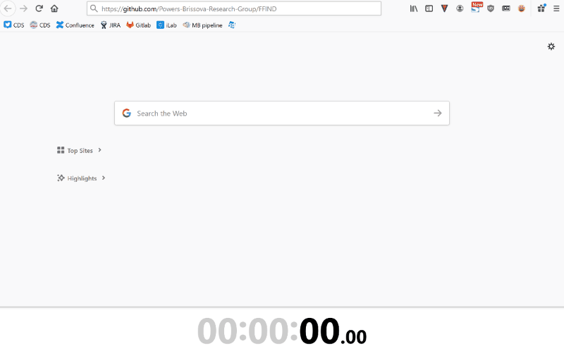
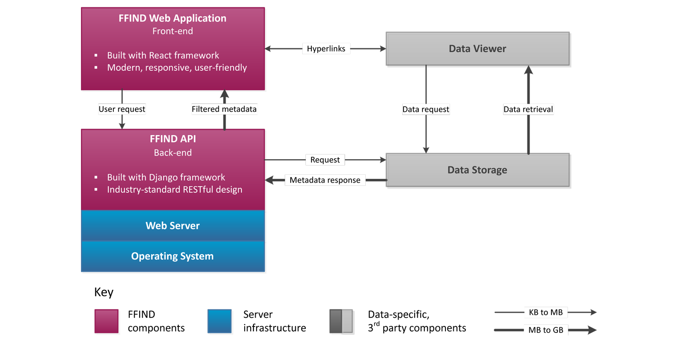

# Flexible Framework for Integrating and Navigating Data - FFIND

FFIND is a generalized framework for connecting to managed data and metadata from diverse sources and making it accessible via an integrated web application that promotes the exploration and discovery of the data. It was developed by the [Powers-Brissova Research Group](https://www.powersbrissovaresearch.org), at Vanderbilt University Medical Center, which is comprised of a multi-disciplinary team of scientists and software engineers.

FFIND was used to develop [Pancreatlas](https://www.pancreatlas.org), whose goal is to provide the scientific community with easily accessible,  detailed, comprehensive images of the human pancreas with the hope that  this will advance our understanding of diseases such as diabetes,  pancreatic cancer, and pancreatitis.  

Get the FFIND web application up and running in less than 5'! Observe...



## System overview

FFIND is comprised of a backend API and a front-end web application. The reason for the backend API is that not all sources that are interesting necessarily come with an API. In other words, FFIND provides a layer that allows us to 1) leverage APIs when they do exist and 2) to create the required business logic for the data in question. In both cases, the consumed data (API-based or direct) is then assembled into a single API end-point that the front-end application talks to (JSON). This allows FFIND to cleanly separate data extraction/transformation from presentation, as shown in the diagram below.



For the purposes of distributing FFIND and providing a working example, instead of relying on external data sources (or APIs), we have provided **mock datasets** that are stored in the same format and structure (JSON) that FFIND expects to retrieve from its API. Hence, the backend API isn't actually used in the live demo of this project.

The two mock datasets are:

1. Abstract dataset - to demonstrate the relationship between metadata and attribute filtering (dataset ID 100)
2. Star Wars Starships - to demonstrate a real-world non-scientific dataset (dataset ID 101)

## Installation of API (Django)

The Django/Python API files are all within the `/api/` project folder. These files are a barebones implementation of Django with the Django REST Framework. Here are some of the relevant details:

 + `/api/ffind-api/api/models.py` holds information about the structure of the data. This can be used to define the metadata associated with specific images or datasets.
 + `/api/ffind-api/api/serializers.py` gives Django information about the fields defined in the models
 + `/api/ffind-api/api/views.py` holds the logic for building responses to API calls

The included JSON files within the React application correspond to the following methods in `views.py`:
| JSON file  | Method  |
|---|---|
| <dataset_id>.json  | `DatasetViewset.get_images`  |
| <dataset_id>-metadata.json  | `DatasetViewset.retrieve`  |
| <dataset_id>-tagsets.json  |  `DatasetViewset.get_tags` |
| mock_datasets.json  | `DatasetViewset.list`  |
| all-datasets.json  |  `ImageViewSet.list`  |
| all-datasets.json  | `ImageViewSet.retrieve`*  |

\* The React application uses this file to lookup information about a specific image
## Installation of web application (React)

### Local

1. Install Node.js (See https://nodejs.org).
2. Clone the repository or download a ZIP file of the master branch to your local machine.
3. Open a terminal, go to the `react/` folder
4. Type `npm install` and wait for all dependencies to be installed
5. Type `npm start` to launch the application. If performed locally, this will execute your default web browser to open up `http://localhost:3000/` on a configured port (`3000 is default`).

### Server

1. Repeat steps 1-4 above on your server of choice.

2. Type `npm run build` to generate a build

3. Set up directory on server and copy all files from `build` directory to your server directory

4. Set up a web server, such as Apache and configure the `httpd.conf` as necessary. Th e following is an example:

   ```
   Directory "/path/to/build">
       Options Indexes FollowSymLinks
       AllowOverride All
       Options -MultiViews
       RewriteEngine On
       RewriteCond %{REQUEST_FILENAME} !-f
       RewriteRule ^ index.html [QSA,L]
       Require all granted
   </Directory>
   ```

5. Restart Apache

6. Open the appropriate URL with your web browser

## Application configuration

By default, FFIND will work but will need to be configured and in some cases customized. For configuration, please look through the following files and make the types of suggested updates:

* `react/public/robots.txt` - replace `ffind.url` with your URL
* `react/public/sitemap.xml` - generate new sitemap and replace this file
* 

## Adding a new dataset


## Licensing

This project utilizes GNU General Public License v3.0 (GNU GPLv3), which detailed in the file called COPYING in the root directory of this project.

